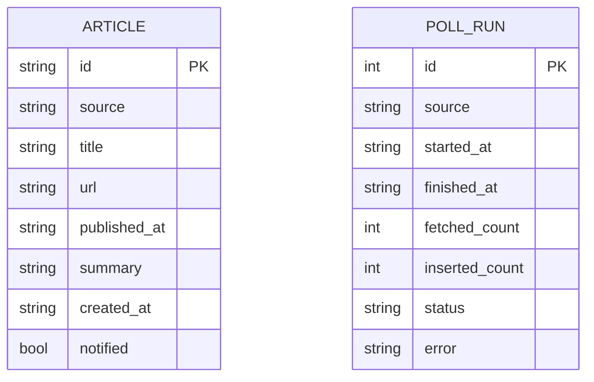
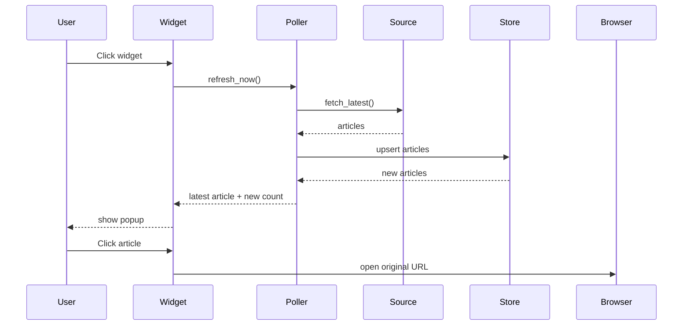

# Architecture

## MVP Boundaries

- Local only, no backend service.
- SQLite stores dedupe state and article history.
- RSS is the first source adapter; sample source keeps the UI runnable before the real source is confirmed.
- PySide6 owns the desktop widget, popup list, and open-link interaction.
- APScheduler handles periodic polling inside the desktop process.

## Data Model

## Sequence

## Review / Backup Points

- Source adapter is isolated behind `ArticleSource`, so 2n can swap Wechat2RSS, local WeChat export, or another public source without changing UI code.
- Store dedupe key is stable hash of source + URL/title, so fallback/sample data does not collide with future real feeds.
- UI can run with sample data, which protects tomorrow's demo from source instability.

